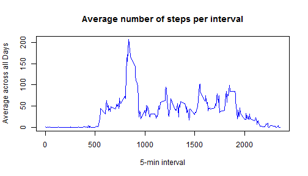

# Peer Assessment 1 --- Activity monitoring data analysis

## Part 1 --- What is mean total number of steps taken per day?

### Here are the processing steps:

1. Load the data (i.e. read.csv())
2. Calculate the total number of steps taken per day
3. Make a histogram of the total number of steps taken each day
4. Calculate and report the mean and median of the total number of steps taken per day

### Here is the code:


```r
indata <- read.csv("activity.csv")
aggdata <- aggregate(steps ~ date, data = indata, sum, na.rm = T)
```
### Here is the plot:

```r
hist(aggdata$steps, main = "Total number of steps taken each day", xlab = "steps", col = "green")
```

 

### Here are the calculations of mean and median:

```r
mean <- as.integer(mean(aggdata$steps))
median <- as.integer(median(aggdata$steps))
```
The mean steps per day is 10766 and the median is 10765

## Part 2 --- What is the average daily activity pattern?

### Here are the processing steps:

1. Producing time-series of 5-minute interval over average number of steps. 
2. Create a plot.
3. Find the max 5-minute interval.

### Here is the code:


```r
time_series <- aggregate(list(steps=indata$steps), list(interval=indata$interval), mean, na.rm=T)
```
### Here is the plot:

```r
plot(time_series$interval, time_series$steps, type = "l", xlab = "5-min interval", 
     ylab = "Average across all Days", main = "Average number of steps per interval",  
     col = "blue")
```

 
### Here is the max interval:

```r
max_index <- which.max(time_series$steps)
max_interval <- time_series[max_index,1] 
```
The max interval is 835
 
 
 
## Part 3 --- Imputing missing values

### Here are the processing steps:


1. Calculate and report the total number of missing values in the dataset (i.e. the total number of rows with NAs)
2. Devise a strategy for filling in all of the missing values in the dataset --- I choose, mean for that 5-minute interval.
3. Create a new dataset that is equal to the original dataset but with the missing data filled in.
4. Make a histogram of the total number of steps taken each day and Calculate and report the mean and median total number of steps taken per day. 
5. Report - Do these values differ from the estimates from the first part of the assignment? 
   What is the impact of imputing missing data on the estimates of the total daily number of steps?

### Here is the total number of NAs:

```r
num_NA <- sum(is.na(indata))
```
The total number of NAs is  2304 

### Calculate the mean of each  5-minute interval:

```r
time_series <- aggregate(list(steps=indata$steps), list(interval=indata$interval), mean, na.rm=T)
```

### Create a new tidy dataset:

```r
tidysteps <- numeric()
 
 for (i in 1:nrow(indata)) {
    row <- indata[i, ]
    if (is.na(row$steps)) {
	    inx <- match(row$interval, time_series$interval)		
        steps <-  time_series[inx,2]     
    } else {
        steps <- row$steps
    }
    tidysteps <- c(tidysteps, steps)
}

 
tidydata <- indata
tidydata$steps <- tidysteps
```

### A histogram of the total number of steps taken each day:

```r
tidy_aggdata <- aggregate(steps ~ date, data = tidydata, sum, na.rm = T)
hist(tidy_aggdata$steps, main = "Total number of steps taken each day", xlab = "steps", col = "green")
```

 

### Cmputing the mean and median:

```r
mean2 <- as.integer(mean(tidy_aggdata$steps))
median2 <- as.integer(median(tidy_aggdata$steps))
```

The mean is 10766 and the median is 10766.

Findings: the mean was not changed. The median was changed a bit. 

## Part 4 --- Are there differences in activity patterns between weekdays and weekends?

### Here are the processing steps:


1. Create a new factor variable in the dataset with two levels - "weekday" and "weekend" indicating whether a given date is a weekday or weekend day.
2. Make a panel plot containing a time series plot (i.e. type = "l") of the 5-minute interval (x-axis) and the average number of steps taken, averaged across all weekday days or weekend days (y-axis). 

### The code for adding factor variable daytype:

```r
tidydata$daylevel <- "weekday"
tidydata$daylevel[weekdays(as.Date(tidydata$date)) == "Sunday"] <- "weekend"
tidydata$daylevel[weekdays(as.Date(tidydata$date)) == "Saturday"] <- "weekend"
tidydata$daylevel <- as.factor(tidydata$daylevel)
```
### The code for the plot:

```r
aggdata <- aggregate(steps ~ interval + daylevel, data = tidydata, FUN="mean")
library(lattice)
xyplot(steps ~ interval | daylevel, aggdata, type = "l", layout = c(1, 2), 
    xlab = "Interval", ylab = "Number of steps")
```

 
   

